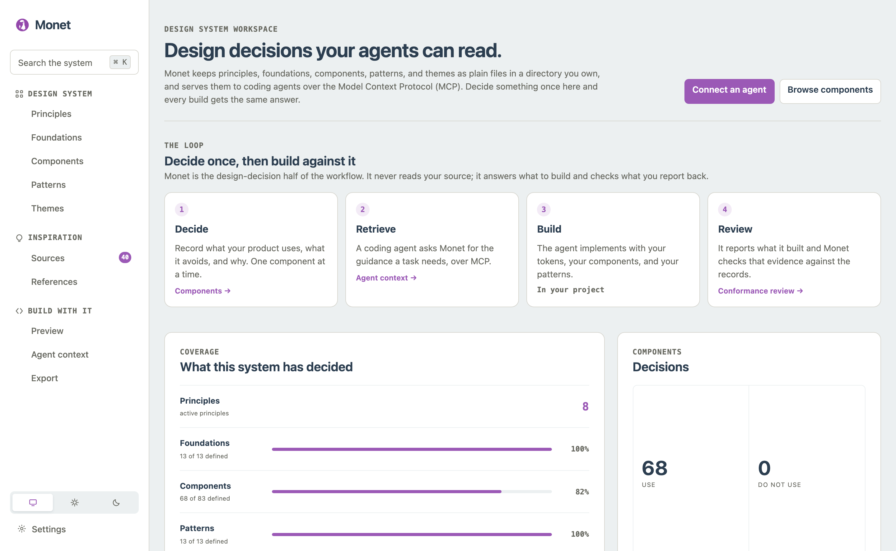

<p align="center">
  
</p>

<h1 align="center">Monet</h1>

<p align="center">
  <b>Your design system, in files a coding agent can actually read.</b>
</p>

<p align="center">
  <a href="https://github.com/arieskg/monet/actions/workflows/check.yml"></a>
  
  
</p>

Monet keeps the decisions behind your interface — colour and spacing values, which components you
use and which you avoid, the patterns you reach for, your themes, and the principles that settle
the close calls — as plain files in a directory you own. It gives you a local editor for them, and
a read-only [Model Context Protocol](https://modelcontextprotocol.io) (MCP) server that hands the
relevant part of them to a coding agent while it builds. When the agent is done it can report what
it actually implemented, and Monet checks that report against the same records.

## The problem

Most design systems are a document. It is accurate on the day it is written, nobody can hold all of
it in their head, and an AI coding agent reads none of it — so it invents an `#f5f5f5`, a `13px`
gap, and a date picker you decided two years ago not to use.

Monet's bet is that the useful form of a design system is not prose but a small set of answerable
questions:

- *Which spacing values exist, and what is this one called?*
- *Do we use a Segmented Control, and if not, what instead?*
- *What does this look like in dark mode?*
- *Is `#ffffff` on `color.surface` a value we actually defined?*

Answer those once, and every build can ask the same source instead of guessing.



## How it works

| | | |
| --- | --- | --- |
| **1. Define** | In the Monet UI | Record what your product uses, what it avoids, and why. |
| **2. Retrieve** | `get_design_context` | An agent asks for the guidance a task needs and gets your answer, not a generic one. |
| **3. Build** | In your project | The agent implements with your tokens, components, and patterns. |
| **4. Review** | `review_design_usage` | It reports what it built; Monet checks that evidence against the records. |

Monet is deliberately one side of this. The agent knows what it wrote; Monet knows what the design
system permits. It never reads your source code.

## What it does

- **Structured decisions, not prose.** Principles, foundations and tokens, components, patterns,
  themes, and saved visual references — each a record with a status, so *undecided* is a real
  answer rather than a gap.
- **Retrieval you can predict.** Ask for "a settings page" and Monet returns the records that
  actually apply, scored by a deterministic matcher. No embeddings and no external index: the same
  question gives the same answer, and every result says how well it really matched.
- **Any MCP client.** A local stdio server with no provider-specific behaviour. It exposes
  resources and three read-only tools; it has no write operations and opens no network listener.
- **Conformance review.** An agent can hand back the values, token names, components, and colour
  pairings it used and get a check against your system. Monet reports what it could not verify
  rather than treating missing information as a pass.
- **Light and dark from one system.** One set of semantic tokens with an optional dark value each,
  so dark mode is a resolution of your design system rather than a second copy of it.
- **Files you own.** No database, no account, no hosted service, and no model API. Markdown and
  JSON on your machine, readable and diffable without Monet.

## Quick start

Requires **Node 20.19+ or 22.12+** and [pnpm](https://pnpm.io/).

```bash
git clone https://github.com/arieskg/monet.git
cd monet
pnpm install
pnpm dev
```

Open **http://127.0.0.1:43140**. The app talks only to a loopback file service on port 43141;
nothing leaves your machine.

You are now looking at the design system bundled with this repository — a complete worked example,
so there is something real to read on the first run. Copy it somewhere you own before editing:

```bash
cp -r monet ~/my-design-system
MONET_ROOT=~/my-design-system pnpm dev
```

An empty directory works too. Monet reads a workspace with no records as a new design system rather
than as an error.

## Connect a coding agent

```bash
pnpm mcp                                # the bundled example
MONET_ROOT=~/my-design-system pnpm mcp  # your own workspace
```

Most MCP clients accept the configuration below; the rest need the same three facts — a command,
its arguments, and optionally `MONET_ROOT`.

```json
{
  "mcpServers": {
    "monet": {
      "command": "pnpm",
      "args": ["--dir", "/absolute/path/to/monet", "mcp"],
      "env": { "MONET_ROOT": "/absolute/path/to/your-design-system" }
    }
  }
}
```

Monet is client-neutral: any client that can launch a local stdio server works, and nothing in the
server is written for a particular one. The UI's **Agent context** page shows this snippet with
your real paths already filled in, and [`docs/MCP.md`](docs/MCP.md) documents every resource, tool,
and argument.

## Your workspace

Monet is the application; a **workspace** is a directory of design-system records that belongs to
you. Every entrypoint resolves it the same way — `--root`, then `MONET_ROOT`, then the example
bundled here — and both the UI and the MCP server print which one they opened.

Principles and patterns are Markdown with frontmatter; foundations, themes, taxonomies, decisions,
sources, and references are JSON. Saving regenerates two readable views alongside them:
`DESIGN_SYSTEM.md`, a summary of the whole system, and `tokens/`, resolved token exports per theme
and mode. Both are derived from the records and carry no timestamps, so they change only when the
design system does.

[`docs/WORKSPACE.md`](docs/WORKSPACE.md) describes the file contract. To check a workspace:

```bash
pnpm validate    # broken token references, dangling links, contrast below your own thresholds
```

## Light and dark

A token's value is its light value; an optional `modes.dark` is its dark value. Everything that
refers to `color.surface` follows it into dark mode, and themes stay override-only, so a product
theme is the handful of values it genuinely changes rather than a second design system. An agent
asking about a dark-mode task gets dark tokens plus the light counterpart of everything that
changed; a workspace with no dark values says plainly that it has none.

## Conformance review

`get_design_context` answers *how should this be built*. `review_design_usage` answers *does what I
built follow it*. The agent submits observations it can collect cheaply from its own output — a
literal colour, a token name, a component, a colour pairing — and Monet checks each against the
resolved records for the theme and mode it was built in.

The limits are part of the design. Monet has no parser and no view of your repository, so a review
is bounded by what the agent reports. Anything your system has no rule for comes back as not
applicable rather than as a failure, and an empty result means nothing reported contradicted the
design system — not that the implementation is correct.

## Optional AI-assisted features

Two features can call a local AI CLI: mapping an external library's inventory into your taxonomy
(Sources), and analysing saved visual references (References). **Both are optional and off by
default.** The workspace, the editor, retrieval, validation, conformance review, and the MCP server
are all deterministic and work with nothing configured.

```bash
export MONET_AI_COMMAND=your-cli   # opt in
```

Monet does not bundle, depend on, or prefer any provider.
[`docs/ARCHITECTURE.md`](docs/ARCHITECTURE.md#optional-ai-assisted-features) documents the exact
call it makes, so you can point it at a wrapper for whichever CLI you already use.

## Documentation

- [`docs/MCP.md`](docs/MCP.md) — resources, tools, retrieval, and client setup
- [`docs/WORKSPACE.md`](docs/WORKSPACE.md) — the workspace file contract
- [`docs/ARCHITECTURE.md`](docs/ARCHITECTURE.md) — how the application is put together
- [`CONTRIBUTING.md`](CONTRIBUTING.md) — development setup and expectations
- [`monet/README.md`](monet/README.md) — about the bundled example workspace

## Development

```bash
pnpm dev        # UI and file service
pnpm mcp        # MCP server on stdio
pnpm validate   # workspace integrity
pnpm check      # build, lint, test, and validate
```

[mise](https://mise.jdx.dev/) is optional; `.mise.toml` pins Node and pnpm and mirrors these as
`mise run dev`, `mise run mcp`, `mise run validate`, and `mise run check`.

## License

MIT. See [LICENSE](LICENSE).

The package is marked `private` because Monet is a clone-and-run application rather than an npm
library: there is no published entry point, and the flag guards against an accidental
`npm publish`. It has no bearing on the licence or on using the code.
